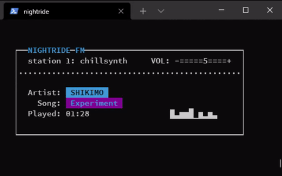

# Nightride FM player
Text-based player for [Nightride FM](https://nightride.fm/) synthwave radio.

  
In this screenshot I am running the player on [cool-retro-term](https://github.com/Swordfish90/cool-retro-term) to give it a bit more retro flavour.  
The player should work on the terminal emulator of your choice however.

## Code

[NightrideAPI.py](./NightrideAPI.py)  
Handles communication with the web audio stream and audio player.

[Radio.py](./Radio.py)  
Text interface for radio. Handles user input and communicates that to the API.

[AudioPlayer.py](./AudioPlayer.py)  
Handles audio player functionality using VLC

[settings.ini](./settings.ini)  
Various settings for the player

[RGB1602.py](./RGB1602.py)  
Controller for optional [Waveshare RGB1602](https://www.waveshare.com/wiki/LCD1602_RGB_Module) LCD module.

## How to start
Developed to work on Linux. I might add support for different operating systems later :)

0. Install dependencies:

        sudo apt update && sudo apt install vlc
        
        pip3 install python-vlc sseclient-py urllib3

1. Run Radio.py:

        python3 Radio.py

## How to use

Press **F1** to pop up a little info screen.

Press **F2** to open station selector.  
Use arrow keys **UP** and **DOWN** to choose station, and press **ENTER** to confirm selection.  
Stations can also be changed using numbers **1** through **9** on the main screen.

Press **PLUS** or **MINUS** to change volume.

Press **F12** to quit.

Press **v** to enable/disable the mock VU-meter.

## Notes

You might want to set your terminal window to 52 colums by 10 rows, as that is the aspect ratio to fit the player perfectly.
