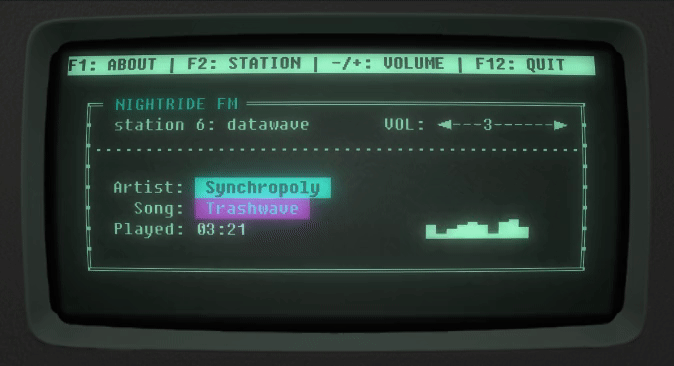

# Nightride FM player
Text-based player for [Nightride FM](https://nightride.fm/) synthwave radio.

The font used is determined by the terminal emulator you are using. The font in screenshot is [VCR OSD Mono](https://www.dafont.com/vcr-osd-mono.font).

The color scheme can also be affected by your terminal settings.

## Project structure

[NightrideAPI.py](./NightrideAPI.py)  
Handles communication with the web audio stream and audio player.

[Radio.py](./Radio.py)  
Text interface for radio. Handles user input and communicates that to the API.

[AudioPlayer.py](./AudioPlayer.py)  
Handles audio player functionality using VLC

[settings.ini](./settings.ini)  
Various settings for the player

[RGB1602.py](./RGB1602.py)  
Controller for optional [Waveshare RGB1602](https://www.waveshare.com/wiki/LCD1602_RGB_Module) LCD module.

## How to use

0. Install dependencies:

        pip3 install python-vlc sseclient-py urllib3

1. Run Radio.py:

        python3 Radio.py
